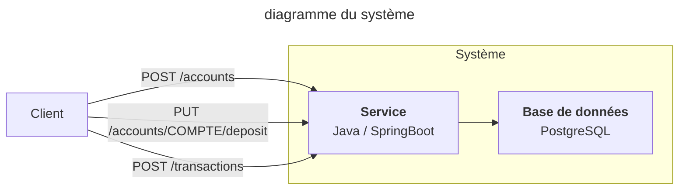
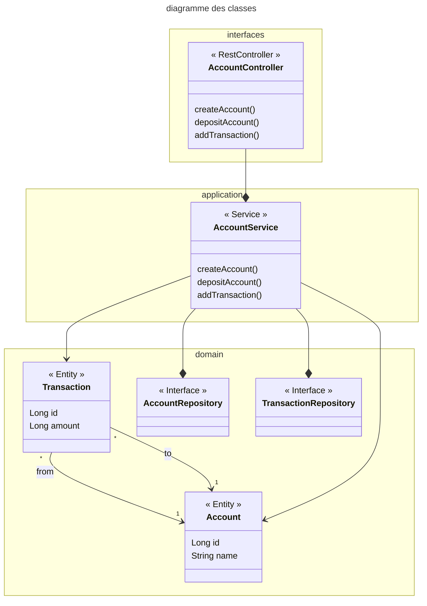

# Entretien technique - Java

## Application Test

L'application Test est une application Spring Boot permettant à des clients d'effectuer des transactions entre leurs comptes, à l'aide d'une API très simple.


L'application est structurée en couches issue du paradigme [Domain Driven Design](https://docs.abp.io/en/abp/4.2/Domain-Driven-Design-Implementation-Guide) : 

- Couche interfaces : contient le controleur REST de l'API `AccountController.java` ainsi que les `dto` (data transfer objects)
- Couche application : classe `AccountService.java` contenant les grandes fonctions du système 
- Couche domaine : entités et dépôts de données



Au démarrage, l'application initialise les comptes d'Alice, Bob et Eve dans la classe `src/main/java/fr/ccomptes/test/TestApplication.java`, ainsi que le compte spécial "banque" qui contient tout l'argent du système.

Tout dépôt d'argent sur un compte est modélié par une transaction entre le compte "banque" et le compte crédité.

## Lancement de l'application

### Via DevContainer

En utilisant la spécification `.devcontainer/devcontainer.json` avec VSCode ou tout IDE supportant les devcontainers.

### Via docker compose et Maven

Démarrer une base de données PostgreSQL sur le port local 5432 dans une console

```bash
docker compose up 
```

Démarrer l'application dans une autre

```bash
mvn spring-boot:run
```

### Via un autre moyen

Configurer les paramètres d'accès à la base de données PostgreSQL dans le fichier `src/main/java/fr/ccomptes/test/AppConfig.java` : 

```java
@Bean
  public DataSource dataSource() {
    DriverManagerDataSource dataSource = new DriverManagerDataSource();
    dataSource.setDriverClassName("org.postgresql.Driver");
    dataSource.setUrl("jdbc:postgresql://localhost/test");
    dataSource.setUsername("test");
    dataSource.setPassword("test123");
    return dataSource;
  }
```

### Utilisation

L'API est utilisable directement sur http://localhost:8080/swagger-ui/index.html

## Instructions 

### (code) Gestion des exceptions :heavy_check_mark:

Les exceptions sont transmises en brut dans les réponses de certaines des API. Améliorer cela en ne laissant passer que le message de l'exception et en positionnant un code HTTP adapté.

### (code) Implémenter les filtres :heavy_check_mark:

Implémenter les filtres sur les méthodes `AccountService.listAccounts` et `ApplicationService.listTransactions`

### (code) Implémenter le test unitaire :heavy_check_mark:

Implémenter le test unitaire dans la méthode `AccountServiceTests.whenInsufficientFunds_thenTransactionFails`.

### (code) Transactionnel :heavy_check_mark:

La méthode `AccountService.addTransaction` souffre de problèmes transactionnels : lesquels ? Comment les corriger ?

#### La méthode implique plusieurs opérations d'écriture mais n'est pas éxécutée au sein d'une transaction. Chaque opération étant traitée et commit individuellement, on peut se retrouver avec une incohérence des données dans le cas où la 1ère opération fonctionne alors que la 2ème échoue (par exemple). Il suffit alors d'annoter la classe (ou la méthode) avec @Transactionnal pour que toutes les opérations soient éxécutées au sein d'une transaction, elles seront alors traitées en batch dans un journal spécifique et le résulat sera persisté dans la bdd seulement si toutes les opérations réussissent.

Ressource utile à consulter : https://www.postgresql.org/docs/current/transaction-iso.html

### (code) Sécurité :heavy_check_mark:

Sécuriser l'API des transactions à l'aide d'une clé d'API qui :

- est initialisée aléatoirement lors de la création d'un compte et sauvegardée dans celui-ci
- est retournée au client après l'initialisation du compte
- est vérifiée lors des appels à `AccountController.addTransaction` par comparaison avec une clé fournie dans une en-tête HTTP `X-API-KEY`.

### (code / architecture) Problème de la double transaction :heavy_check_mark:

Il peut arriver qu'un client passe deux fois la même transaction par erreur.
> Par exemple, lors d'une perte du réseau entre l'envoi d'une transaction et la réception de l'acquittement du service, le client ne peut pas savoir si sa transaction a bien été passée, et peut être incliné à la refaire. 

Comment se prémunir contre ce type de problème et quels sont les impacts sur les entités du domaine et sur le client ?

#### Une solution simple qui me vient en tête est de générer un token (indempotency key) côté client qui servira à identifier la transaction. L'utilisateur ouvre la page permettant de faire une transaction, un token est alors généré et lorsque l'utilisateur valide sa transaction, le token est envoyé avec le reste du formulaire. En back on conserve une liste des token (en bdd si on veut, ou tout simplement avec une map). Si l'utilisateur renvoie le même formulaire, alors le token sera le même et la requête sera rejetée. Les impacts seront uniquement sur les DTO et non sur les objets domain.

### (code / architecture) Intégrité :heavy_check_mark:

Un invariant doit être toujours respecté tout le long du cycle de la vie de l'application : la somme des crédits doit toujours être égale à la somme des débits sur tous les comptes (la somme totale d'argent dans le système doit être constante).

Implémenter une vérification de l'intégrité des transactions dans la méthode `ApplicationService.verification`.

Peut-on maintenir l'intégrité partiellement ou totalement à l'aide de contraintes d'intégrité définies dans la base de données PostgreSQL ?

### (architecture) Passage à  l'échelle :heavy_check_mark:

A chaque transaction, l'application met à jour les soldes des comptes concernés, ce qui pose des problèmes de passage à l'échelle.

- D'où viennent les pertes de performance en cas d'accroissement de charge ?
#### Les multiples écritures (1 pour la transaction, 1 pour le compte source, 1 pour le compte receveur) en base peuvent entrainer des pertes de performances.
- Quels changements architecturaux peuvent être faits afin de garantir que les transactions restent instantanées pour les clients malgré l'accroissement de la charge, et quels sont les compromis à faire sur la cohérence du système ?
#### On peut déjà imaginer un cluster de bdd plutôt qu'une simple instance. Ce cluster aurait des instances de lectures et des instances d'écriture afin de répartir la charge sur la bdd. On peut aussi avoir un sytème de cache avant la BDD afin de servir les données plus rapidement en lissant les effets de charges sur la BDD, a ce moment là le compromis à faire est sur la cohérence entre les données réellement en BDD et celles dans le cache. A un instant T il est possible que la BDD soit en retard par rapport au cache.


### (architecture) Evolution de l'architecture logicielle :heavy_check_mark:

Quelles sont les différences entre les architectures "Hexagonal Architecture" et "Clean Architecture" ? quels sont les facteurs qui guideraient l'évolution de l'architecture actuelle vers l'une ou l'autre ?

#### Le principe de base de la "Clean Architecture" et de l'"Hexagonal Architecture" est l'indépendances de toutes les couches. Indépendance au framework, à la base de données, aux interfaces utilisateurs, ... Tout doit être indépendant afin de pouvoir changer de technos ou d'interfaces sans avoir à modifier le code métier.
#### Dans le cas de l'archi hexagonale on a 3 couches : le noyau qui contient la logique métier (très souvent réalisé en DDD), les ports (dont le contrat est définie par le noyau) permettent d'exposer les services du noyau et les adaptateurs (qui implémentent les ports) qui permettent d'exposer les services métiers aux éléments extérieurs (IHM, API, BDD, ...).
#### La clean archi est légèrement différente mais tout de même similaire, on va y retrouver : les entités (ce sont les objets métiers), les cas d'usages (ils utilisent les entités pour implémenter la logique métier), les adaptateurs qui permettent d'exposer les services métiers aux éléments extérieurs (IHM, API, BDD, ...).
#### Selon moi la principale différence est que sur le papier l'archi hexagonal laisse la possibilité d'avoir des dépendances plus fortes entre les modules là où la clean archi l'interdit. Ce sont 2 noms différents pour des archi très similaires.
#### Ce genre d'archi n'est pas forcément recommandé sur des très petits/petits projets car il y a un coût d'entrée non négligeable. Mais sur des projets plus importants avec une composante métier forte que l'on veut vraiment isoler des technos utilisées, je dirais que le choix va se faire en fonction de l'habitude de l'équipe à utiliser l'hexagonale ou la clean.


### (devops) Construction de l'image Docker :heavy_check_mark:

Réaliser le `Dockerfile` permettant de construire une image Docker du service à l'aide de l'instruction suivante : 

```bash
docker build . -t service-test-java
```

L'image doit permettre le lancement de l'application spring-boot au démarrage du conteneur.